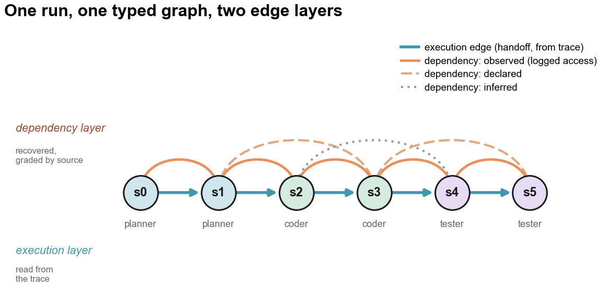
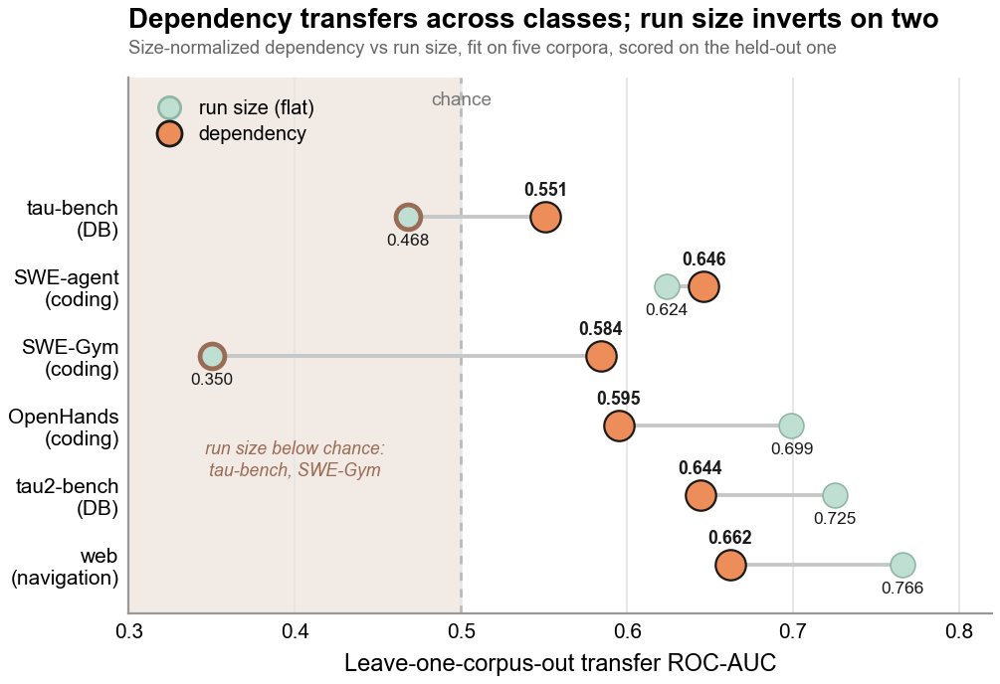
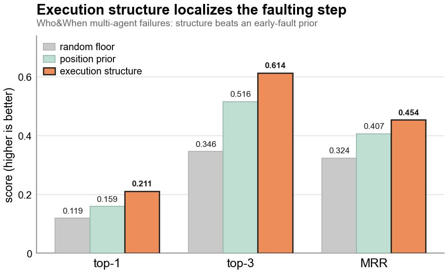

<div align="center">

# GRADE

**A two-layer graph representation of LLM-agent runs.**

[](LICENSE)


[Install](#install) · [Quickstart](#quickstart) · [What It Finds](#what-it-finds) · [API](#public-api-grade) · [Experiments](#experiments)

</div>

<p align="center">
  
</p>

Can one graph represent every kind of agent run? A trace records what each step
did, never what it relied on, the state it read, or the results it reused.
**GRADE** (Graph Representation of Agent Dependency and Execution) recovers that
missing layer. It models any run as one typed graph over its step nodes with two
edge layers:

- 🟦 **Execution layer**: what ran in what order, read from the trace for free (`emits`, `handoff_to`).
- 🟧 **Dependency layer**: what each step relied on, rarely logged, so each edge is graded by how it is known, **observed**, **declared**, or **inferred** (`depends_on`).

One representation, and each layer earns its place. This repository holds the
representation, a layered structural-feature module, and the experiments that
demonstrate its value: run-failure prediction across corpora, leave-one-corpus-out
transfer, an observed-vs-inferred gate, off-the-shelf graph-network baselines, and
step-level fault localization.

> [!NOTE]
> Datasets are not bundled. Most corpora stream from the Hugging Face Hub at
> runtime; two need a local path. See [Data](#data).

## Install

```
pip install -e .
```

Core requires Python >= 3.10 and `networkx`. The experiment scripts need the
`experiments` extra; the graph-network baselines additionally need the `gnn`
extra (PyTorch + PyTorch Geometric):

```
pip install -e ".[experiments]"      # numpy, scipy, scikit-learn, data loaders
pip install -e ".[experiments,gnn]"  # + torch, torch_geometric for the GNN scripts
```

## Quickstart

```python
from grade import build_graph, characterize, feature_vector

# one run = an ordered list of step dicts (idx, agent, kind, and optional deps)
steps = [
    {"idx": 0, "agent": "a", "kind": "tool_call"},
    {"idx": 1, "agent": "a", "kind": "decision", "deps": [0]},
    {"idx": 2, "agent": "a", "kind": "tool_call", "deps": [1]},
]
G = build_graph(steps, dependency="explicit", shared_resource=False)
print(characterize(G))            # node/edge/layer counts, dependency depth
names, values = feature_vector(G) # layered structural features
```

The figure at the top is built by this same API. Regenerate all three figures
with `python assets/make_figures.py` (needs `matplotlib`).

## What It Finds

Two demonstrated capabilities, one per layer: the **dependency layer** predicts
failure where run size is weak, and the **execution layer** localizes where a run
fails.

### Failure Prediction Transfers Across Agent Classes

<p align="center">
  
</p>

Fit on five corpora and scored on the sixth, the size-normalized dependency
signal stays above chance on every held-out class. Run size, by contrast, inverts
below chance on tau-bench and SWE-Gym. Dependency structure carries failure
information that run size alone misses.

### The Execution Layer Localizes the Faulting Step

<p align="center">
  
</p>

On Who&When multi-agent failures, ranking steps by execution-graph structure
beats an early-fault position prior on top-1, top-3, and MRR, and both clear the
random floor.

## Public API (`grade`)

- `build_graph(steps, *, dependency="full_context", shared_resource=True)`: build
  the typed two-layer graph. `dependency` is `"full_context"` (full-history
  inferred), `"chain"`, or `"explicit"` (observed, from logged accesses).
- `dependency_dag(G)`: the `depends_on` projection as a simple DAG.
- `characterize(G)`: per-graph structural properties.
- `downstream_reach(G, step_idx)`: transitive blast radius of a step.
- `layered_features(G)` / `feature_vector(G, *, layer=...)`: layered structural
  features. `layer` picks the column set: `"flat"` (size/counts), `"exec"`
  (flat + execution topology), `"full"` (flat + exec + raw dependency counts). The
  paper's main "beyond run size" result uses `"flatdep"` (flat + size-normalized
  dependency) versus `"flat"`; `"flatdens"` is the revisit-density control and
  `"depnorm"` is the dependency-only transfer set.
- Constants: `NODE_TYPES`, `EXECUTION_EDGES`, `DEPENDENCY_EDGES`.

## Experiments

Each script prints its results to stdout (most as ROC-AUC tables). Run from the
repository root:

```
python experiment/<script>.py
```

| Script | Reproduces |
|---|---|
| `agent_graph_characterization.py` | representation faithfulness: every step maps to the four node types |
| `agent_graph_swebench_crossfile.py` | cross-file dependency is uncommon and shallow (SWE-bench_Verified gold patches) |
| `agent_failure_detection.py` | keystone: run-level failure prediction, run size vs run size + size-normalized dependency block |
| `agent_failure_gating.py` | the observed-vs-inferred gate and the saturation ratio that separates the regimes |
| `graph_gnn.py` | an edge-type-blind GIN trails the source-aware features |
| `graph_gnn_inferred.py` | the same GIN on observed vs inferred graphs |
| `graph_gnn_relational.py` | relation-aware GNNs (R-GCN, HGT) vs the source-aware features |
| `agent_failure_localization.py` | step-level fault localization: execution structure beats an early-fault prior |
| `diagnose_layers.py` | layer-by-layer diagnosis |

<details>
<summary>Corpus loaders and a dropped corpus</summary>

<br>

Corpus loaders build the two-layer graph per run from each trace:
`agent_graph_tau_bench.py`, `agent_graph_tau2_bench.py`, `agent_graph_swe_agent.py`,
`agent_graph_swegym.py`, `agent_graph_openhands.py`, `agent_reward_bench.py`.
`agent_graph_scienceworld.py` is a dropped corpus, kept for the record.

</details>

## Data

Datasets are not bundled. Most corpora download from the Hugging Face Hub at
runtime (set `HF_TOKEN` for higher rate limits). Two need a local path:

- AgentRewardBench (the web corpus): set `ARB_DIR` to its data root.
- Who&When (localization): cached under `experiment/.cache/whoandwhen/` (gitignored).

## License

MIT. See [`LICENSE`](LICENSE).

## Citation

```bibtex
@misc{grade2026,
  title  = {{GRADE}: Graph Representation of {LLM} Agent Dependency and Execution},
  author = {Yue Zhao},
  year   = {2026},
  eprint = {2606.22741},
  archivePrefix = {arXiv}
}
```
